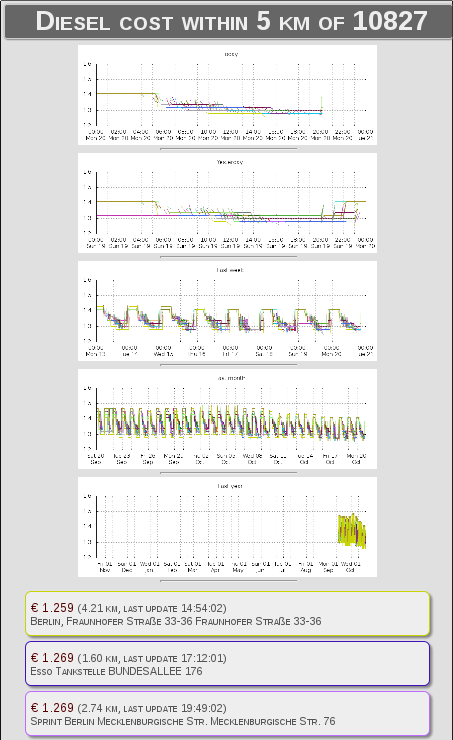

dieseltracker
=============

Tracks diesel prices, plots daily, weekly, monthly, yearly price history of
gas stations nearby a pre-configured area. A list of currently cheapest gas
stations is generated, and price history of each gas station can be queried.
Because of the nature of the pricing data this works only for Germany right now.

Inspired by a bash workshop by Harald König.
